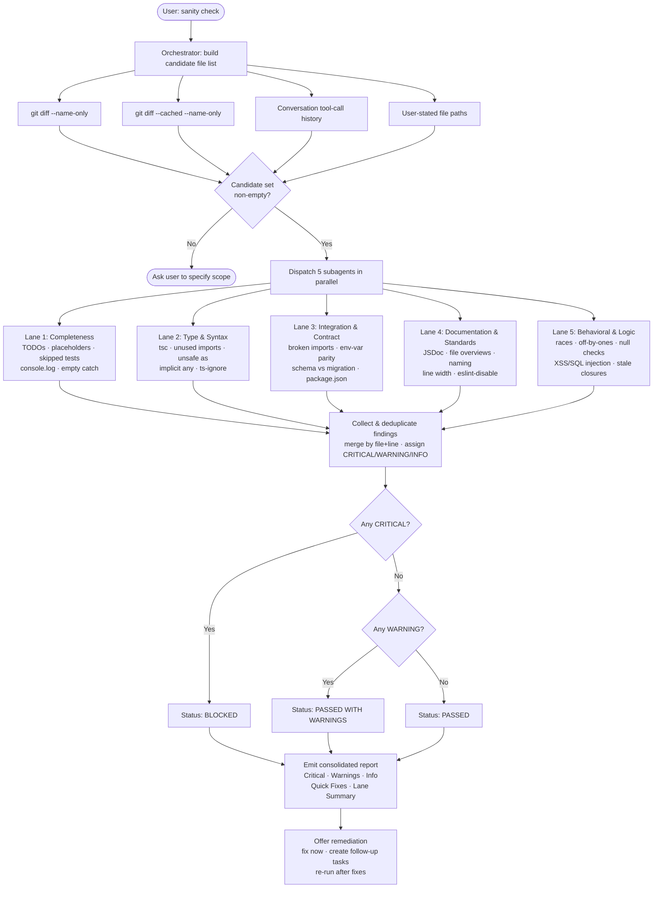

# sanity-check
An orchestrator skill that runs a **five-lane independent sanity audit** over
everything modified or created during the current conversation (or whatever
file set the user provides). Each lane is a dedicated subagent with a narrow
mandate — completeness, type safety, integration contracts, documentation
standards, behavioral logic — run in parallel, with results merged into a
single severity-ranked consolidated report.

Unlike narrow checkers that only run `tsc` or `eslint`, `sanity-check`
verifies that the work is **complete, consistent, integrated, documented,
and logically sound** before it is considered done.

## Install

The fastest cross-agent install path is the `skills` CLI:

```bash
npx skills add gg-skills/sanity-check
```

Drop this skill into a workspace as a Git submodule for pinned versions, or as a plain clone for latest `main`:

```bash
# Project-local, version-pinned:
git submodule add git@github.com:gg-skills/sanity-check.git .claude/skills/sanity-check

# OR project-local, latest main:
mkdir -p .claude/skills
git -C .claude/skills clone git@github.com:gg-skills/sanity-check.git

# OR user-level, available in every project on this machine:
mkdir -p ~/.claude/skills
git -C ~/.claude/skills clone git@github.com:gg-skills/sanity-check.git
```

Restart your agent or reload skills after installation. See the parent [`skills` catalog repo](https://github.com/gg-skills/skills) for the full catalog.

## When to use

- The user says "sanity check", "check my work", "verify everything", or
  "did I miss anything?"
- A non-trivial development task (more than ~3 files or cross-module
  changes) has just completed.
- A refactor, extraction, or merge concluded and needs independent
  validation.
- Before a commit or PR when the human wants agent-assisted confidence.

Skip when the task is a single-line trivial fix, when the user explicitly
asked for only one specific check (e.g. "just type-check this"), or when a
prior sanity check already ran in this conversation with no intervening
changes.

## How it operates

### Inputs

The orchestrator builds the **candidate file list** from four sources,
deduplicated:

1. **Conversation tool-call history** — every file path that appeared in a
   `write_file`, `edit_file`, `create_file`, or `delete_file` call during
   the current session.
2. **User-stated files** — paths the user named explicitly in their latest
   request.
3. **Unstaged changes** — output of `git diff --name-only` (working tree vs
   HEAD).
4. **Staged changes** — output of `git diff --cached --name-only` (index vs
   HEAD).

If the candidate set is empty after combining all four sources, the
orchestrator asks the user what they would like audited rather than
proceeding with no scope.

> Deleted files are included. A deleted export can break an unmodified
> importer; the candidate set must capture removals, not just
> modifications.

### Outputs

The skill produces a single **consolidated report** (not five separate
subagent dumps) structured as:

| Section | Content |
|---------|---------|
| **Status line** | One of: `PASSED` / `PASSED WITH WARNINGS` / `BLOCKED` / `INCOMPLETE` |
| **Critical Findings** | Must-fix issues (`CRITICAL` severity), grouped by file with `file:line` citation |
| **Warnings** | Should-fix issues (`WARNING`), same shape |
| **Info** | Nice-to-have observations (`INFO`), may be summarized in bulk |
| **Quick Fixes** | Verbatim one-line edits the user can accept immediately |
| **Lane Summary** | Table showing status and finding count for all five lanes |
| **Suggested next step** | One concrete call to action |

The full template, section-ordering rules, and edge-case phrasing (zero
findings, lane errored, >10 findings in one file) live in
[`references/consolidated-report-format.md`](references/consolidated-report-format.md).

**Status rules:**
- `BLOCKED` fires as soon as any lane returns a `CRITICAL` finding.
- `INCOMPLETE` fires if any lane failed to run — never silently downgraded
  to `PASSED`.
- Empty sections (`(none)`) are always emitted to keep the report shape
  consistent across runs.

### External commands

Lane 2 (Type & Syntax) runs the project's own type-check commands via
subagent shell access. No commands ship inside this skill:

| Package | Command |
|---------|---------|
| Root scripts | `npx tsc --noEmit --skipLibCheck scripts/*.ts` |
| core-package | `npm run type-check --prefix core-package` |
| ui-package | `npm run ts:check --prefix ui-package` |
| manager-astro-package | `npm run ts:check --prefix manager-astro-package` |
| manager-next-package | `npm run ts:check --prefix manager-next-package` |

Each command is run from the **repo root** so `--prefix` resolves the
correct `node_modules`. The subagent captures both exit code and stderr —
some checkers exit 0 on warnings, so the output is grepped for `error TS`
independently.

All other lanes (1, 3, 4, 5) operate by reading files and applying
pattern catalogs — no shell commands beyond `grep` style searches.

### Side effects

- **Orchestrator writes nothing.** The orchestrating agent only reads
  `SKILL.md` and dispatches subagents. It never modifies files.
- **Subagents read only.** Each of the five lane subagents calls
  `read_file` to inspect the current on-disk state of every candidate file.
  Subagents do not write, move, or delete files.
- **No caching.** Every invocation re-reads all candidate files from disk.
  This is intentional — the user may have edited files externally between
  the change and the sanity check.
- **Remediation is opt-in.** After presenting the report, the orchestrator
  *offers* to fix critical issues; it does not apply fixes automatically.

### Mode toggles

| Situation | Behavior |
|-----------|----------|
| User scopes to a subset ("only check `core-package/src/auth/`") | Candidate list is restricted; report **Scope** line echoes the restriction |
| Report exceeds ~50 findings | Orchestrator recommends partitioning by package before continuing |
| One file has >10 findings in a single lane | That lane's findings move to an appendix rather than flooding the Critical/Warning sections |
| A lane errors (e.g. `tsc` not installed) | Status becomes `INCOMPLETE`; the lane's error message appears in the Lane Summary |

## Operational flow



## Layout

```
.
├── SKILL.md                                  ← entry point: five-lane mandates + orchestration workflow
├── agents/
│   └── openai.yaml                           ← IDE / agent descriptor
├── references/                               ← load-on-demand long-form guidance
│   ├── lane-criteria.md                      ← per-lane pattern catalogs, severity heuristics, worked examples
│   └── consolidated-report-format.md         ← full report template + edge-case phrasing
│                                               (zero findings, lane errored, large-file appendix, user-scoped subset)
└── assets/                                   ← skill icons (large/small/master + prompt sources)
```

No `scripts/` directory — this skill spawns subagents and runs project-local
commands (`tsc`, `eslint`, `git diff`) rather than shipping its own
executables.

## Quick start

Read [`SKILL.md`](./SKILL.md) first — it carries the five lane mandates, the
five-step orchestration workflow (discover → spawn → collect → present →
remediate), the type-check command table, and the troubleshooting matrix.

The skill is invoked by spawning **five parallel subagents** — do not
combine lanes to save time. Each subagent receives the same candidate file
list (built from tool-call history, user mention, `git diff --name-only`,
and `git diff --cached --name-only`) but inspects it through a different
lens:

1. **Completeness** — TODOs, placeholders, skipped tests, missing error handling
2. **Type & Syntax** — `tsc`, unused imports, unsafe `as`, implicit `any`
3. **Integration & Contract** — broken imports after rename, env-var docs, schema/migration parity
4. **Documentation & Standards** — JSDoc, file overviews, naming, line width
5. **Behavioral & Logic** — races, off-by-ones, null checks, side effects, security

Each subagent should `read_file` to inspect the **current** state of every
file — never rely on the assistant's memory of what was written.

## Resources

- [SKILL.md](SKILL.md) — entry point with five lane mandates and orchestration workflow
- [agents/openai.yaml](agents/openai.yaml) — agent / IDE descriptor
- [references/lane-criteria.md](references/lane-criteria.md) — per-lane pattern catalogs and severity heuristics
- [references/consolidated-report-format.md](references/consolidated-report-format.md) — final-report template and edge cases
- [assets/](assets/) — skill icons and icon-prompt sources

## Caveats

- **All five lanes, every time.** Each lane catches issues the others miss.
  Do not combine lanes to save time.
- **Independence matters.** The same agent that wrote the code should not be
  the sole validator — that is the whole point of spawning fresh subagents.
- **Re-read from disk.** Never trust the assistant's memory of what was
  written; the user may have edited files externally between the change and
  the sanity check.
- **Include deletions.** A deleted export can break an unmodified importer.
  The candidate set must include deleted files, not just modified/created
  ones.
- **Repo-level standards live in the consuming repo,** not in this skill.
  The Documentation & Standards lane loads `docs/TYPESCRIPT_STANDARDS_*.md`,
  `docs/FIELD_NAMING.md`, and `docs/TAXONOMY_ECOSYSTEM.md` from the host
  project when present.
- **If the report exceeds ~50 findings,** the task was too large for one
  sanity pass — ask the user to scope to a specific package or subset of
  files before re-running.
- **Always synthesize.** Raw subagent outputs are too noisy to hand to the
  user; the consolidated report format in
  [`references/consolidated-report-format.md`](references/consolidated-report-format.md)
  is the contract.
